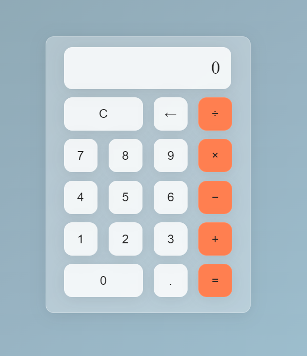

# Hesap Makinesi

---
Javascript öğrenmeye başladığımda yaptığım basit bir hesap makinesi.Çalışmamda HTML5, CSS ve JavaScript kullandım.

## Özellikler
- Matematiksel işlemler: Toplama (+), çıkarma (-), çarpma (*) ve bölme (/) işlemleri yapabilirsiniz.
- Ondalık Nokta: Ondalık sayıları hesaplamalara dahil edebilirsiniz.
- Silme: Hesap makinesi ekranından son karakteri silebilirsiniz.
- Temizleme: Hesap makinesini sıfırlayarak başlangıç değerlere geri dönebilirsiniz.
